# Orchestrated Streaming App

This project demonstrates the containerization, continuous integration, orchestration, scaling, monitoring, logging, and notification workflow for a MERN streaming application. The application consists of a React frontend, four Node.js backend services (Auth, Streaming, Admin, and Chat), and MongoDB.

The source application is included in `StreamingApp/.` Infrastructure-as-code resources are included in `helm/streamingapp/` and IAM policies in `iam/`.

# Architecture

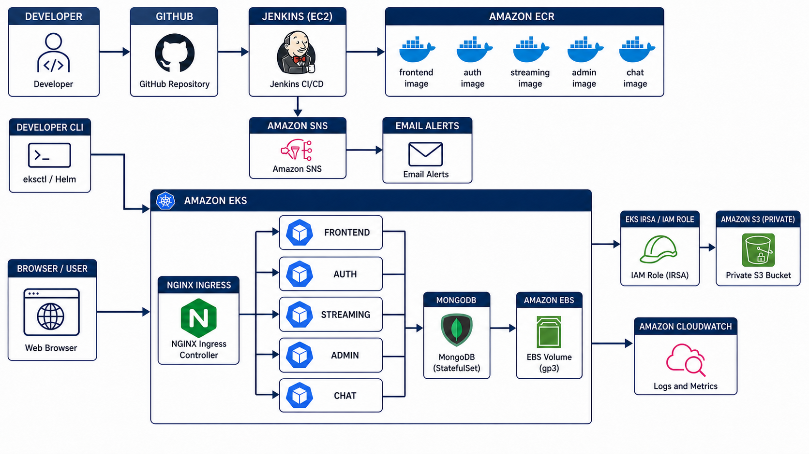

The developer pushes source code to GitHub. Jenkins runs on an EC2 instance, builds the Docker images, pushes versioned images to ECR, and sends build notifications through SNS. EKS pulls the images from ECR. An NGINX Ingress load balancer exposes the frontend and API routes. MongoDB stores application data on EBS, while the streaming service uses an IRSA IAM role to access the private S3 bucket. Container Insights sends EKS logs and metrics to CloudWatch.

## 1. Repository Setup

- Fork `UnpredictablePrashant/SampleMERNwithMicroservices`
- Clone your fork:
  - `git clone https://github.com/anilkumarrajana/StreamingApp.git`
  - `cd Streamingapp`
- Sync with upstream:
  - `git remote add upstream https://github.com/UnpredictablePrashant/SampleMERNwithMicroservices.git`
  - `git fetch upstream`
  - `git merge upstream/main`
  - `git push origin main`

## 2.Containerize the Application

- Inspect the source project and Docker configuration
  - `docker compose config --services`
  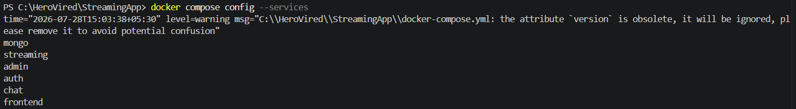
- Verify Docker Desktop
  - `docker info`
  - `docker compose version`
  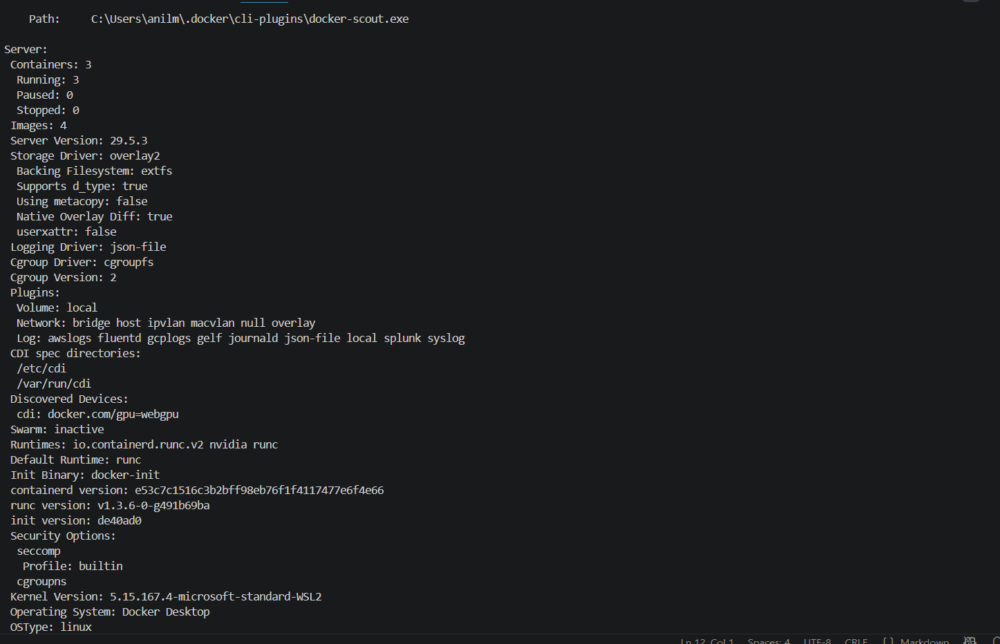
- Start the MERN Application Locally
  - `docker compose up -d --build`
    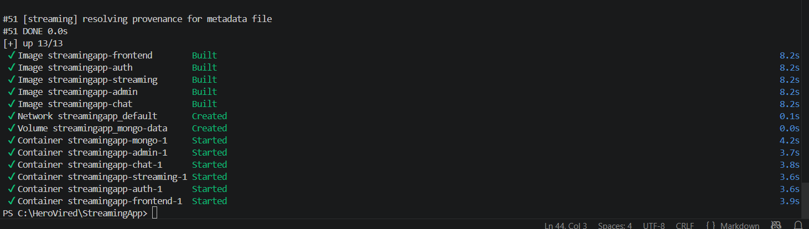
  - `docker compose ps`
    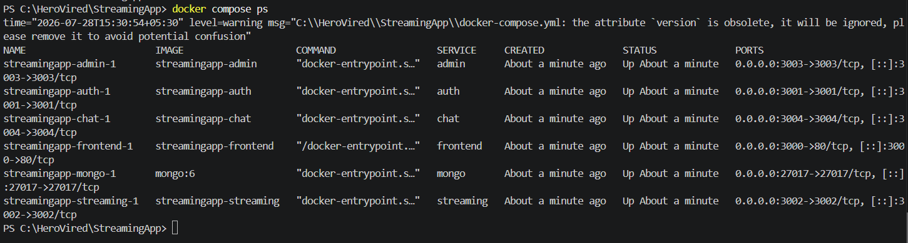
  - `docker compose images`
    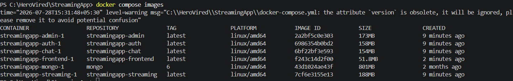
- Check container logs when required

    ```bash
    docker compose logs --tail=100 frontend
    docker compose logs --tail=100 auth
    docker compose logs --tail=100 streaming
    docker compose logs --tail=100 admin
    docker compose logs --tail=100 chat
    ```

- Validate Local Frontend
  - Open `http://localhost:3000` and confirm that the home page loads.
    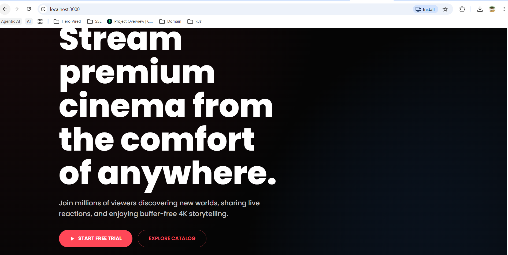

## 3.AWS CLI & ECR Setup

- Verify AWS CLI installation
  - `aws --version`
- Configure the named AWS CLI Profile

  ```bash
  aws configure --profile streamingapp
  aws sts get-caller-identity --profile streamingapp
  ```
  
  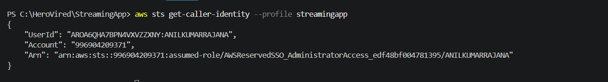

- Set reusable local variables
  
  ```powershell
    $env:AWS_PROFILE = "streamingapp"
    $env:AWS_REGION  = "ap-south-1"
    $AWS_ACCOUNT_ID = aws sts get-caller-identity --profile $env:AWS_PROFILE --query Account --output text
    $env:ECR_REGISTRY = "$AWS_ACCOUNT_ID.dkr.ecr.$env:AWS_REGION.amazonaws.com"
  ```

- Create private ECR repositories

  ```Powershell
  $repos = @(
    "streaming-frontend",
    "streaming-auth",
    "streaming-streaming",
    "streaming-admin",
    "streaming-chat"
  )

  foreach ($repo in $repos) {
    aws ecr create-repository `
      --repository-name $repo `
      --image-scanning-configuration scanOnPush=true `
      --region $env:AWS_REGION `
      --profile $env:AWS_PROFILE
  }
  ```

- Verify ECR Repositories

  ```bash
  aws ecr describe-repositories --region ap-south-1 --profile streamingapp --query "repositories[].repositoryName" --output table
  ```

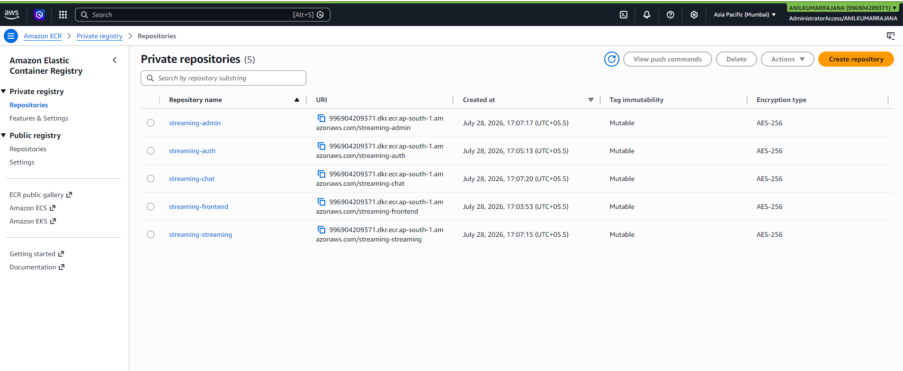

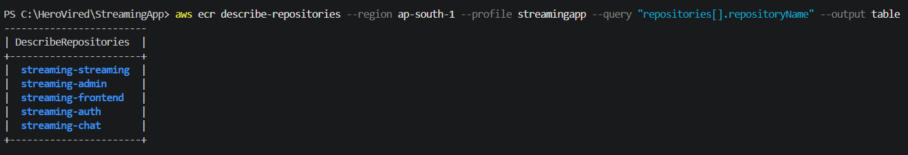

- Log Docker in to ECR

  ```bash
  aws ecr get-login-password --region "$AWS_REGION" --profile "$AWS_PROFILE" | \
  docker login --username AWS --password-stdin "$ECR_REGISTRY"
  ```

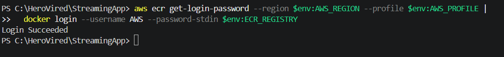

- Build the frontend image for AMD64

    ```bash
      docker buildx build --platform linux/amd64 `
      -t "$env:ECR_REGISTRY/streaming-frontend:$env:IMAGE_TAG" `
      --push `
      .\frontend
    ```

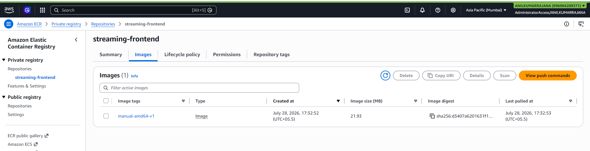

- Build Image for Authentication Service in backend

  ```bash
    docker buildx build --platform linux/amd64 `
      -t "$env:ECR_REGISTRY/streaming-auth:$env:IMAGE_TAG" `
      --push `
      .\backend\authService
  ```

  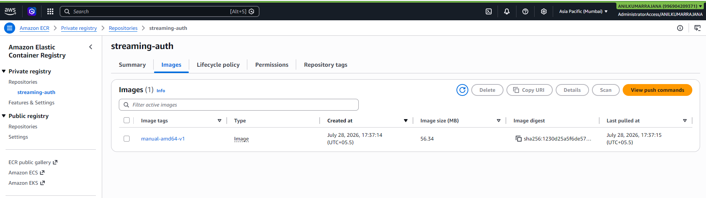

- Build Image for Streaming Service in backend

  ```bash
  docker buildx build --platform linux/amd64 `
    -t "$env:ECR_REGISTRY/streaming-streaming:$env:IMAGE_TAG" `
    --push `
    .\backend\streamingService
  ```

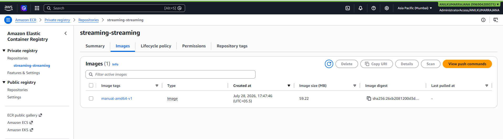

- Build Image for Admin Service in Backend

  ```bash
  docker buildx build --platform linux/amd64 `
    -t "$env:ECR_REGISTRY/streaming-admin:$env:IMAGE_TAG" `
    --push `
    .\backend\adminService
  ```

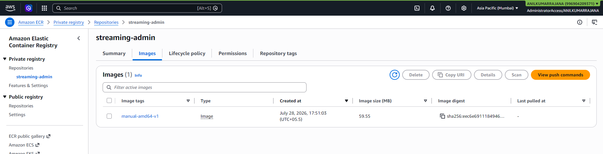

- Building Image for Chat Service in Backend

  ```bash
  docker buildx build --platform linux/amd64 `
    -t "$env:ECR_REGISTRY/streaming-chat:$env:IMAGE_TAG" `
    --push `
    .\backend\chatService
  ```

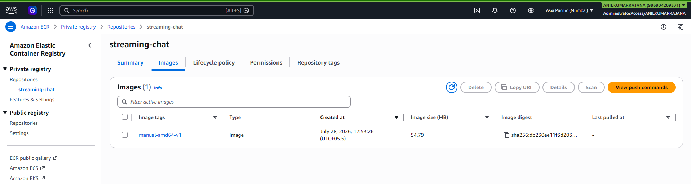

- Verify the Image architecture and ECR Tags

  ```bash
  $env:AWS_REGION = "ap-south-1"
  $env:AWS_PROFILE = "streamingapp"

  $repos = @(
    "streaming-frontend",
    "streaming-auth",
    "streaming-streaming",
    "streaming-admin",
    "streaming-chat"
  )

  foreach ($repo in $repos) {
    Write-Host "`n$repo"
    aws ecr describe-images `
      --repository-name $repo `
      --region $env:AWS_REGION `
      --profile $env:AWS_PROFILE `
      --query "imageDetails[].imageTags" `
      --output table
  }
  ```

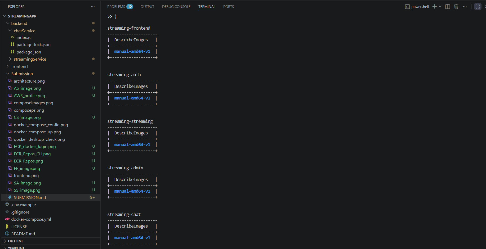

# 4 — Continuous Integration with Jenkins

- ## Provision Jenkins on EC2

- Launch an EC2 instance (Ubuntu 22.04, t3.medium or larger).
- Open inbound ports 22 (SSH) and 8080 (Jenkins UI) in the security group.
- Install Jenkins:

    ```bash
      sudo apt update
      sudo apt install -y openjdk-17-jre docker.io awscli
      curl -fsSL https://pkg.jenkins.io/debian-stable/jenkins.io-2023.key | sudo tee \
        /usr/share/keyrings/jenkins-keyring.asc > /dev/null
      echo "deb [signed-by=/usr/share/keyrings/jenkins-keyring.asc] \
        https://pkg.jenkins.io/debian-stable binary/" | sudo tee \
        /etc/apt/sources.list.d/jenkins.list > /dev/null
      sudo apt update
      sudo apt install -y jenkins
      sudo usermod -aG docker jenkins
      sudo systemctl enable --now jenkins
    ```

    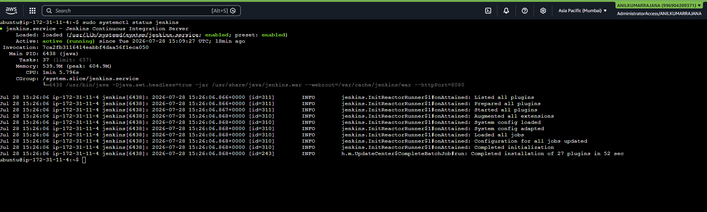
    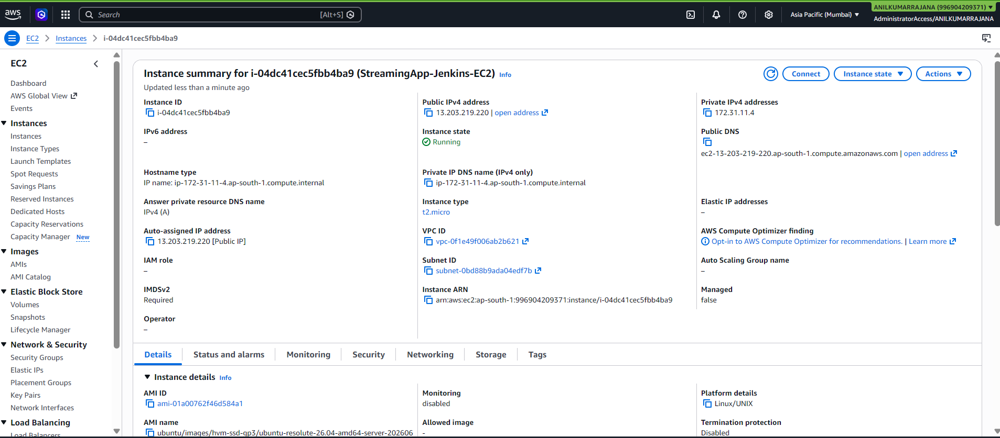

- Unlock Jenkins at `http://13.203.219.220:8080/` using `/var/lib/jenkins/secrets/initialAdminPassword`.
- Install plugins
  - Docker Pipeline
  - Amazon ECR
  - Git / GitHub Integration
  - Kubernetes CLI / Helm (or install kubectl + helm directly on the agent)
  - Pipeline: AWS Steps

  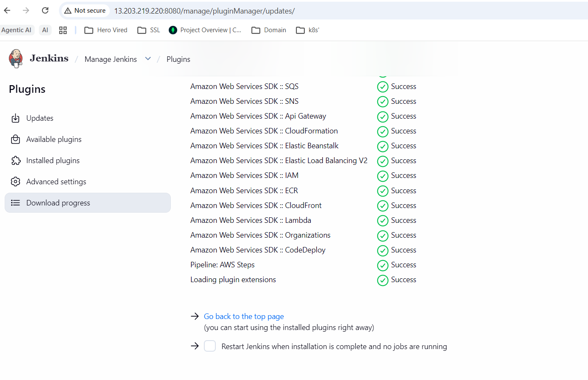

- Configure credentials
  In Manage Jenkins → Credentials, add:
  `aws-creds` — AWS access key/secret (or better: attach an IAM role to the EC2 instance and skip storing keys)
  `github-creds` — GitHub personal access token, for the webhook/checkout

  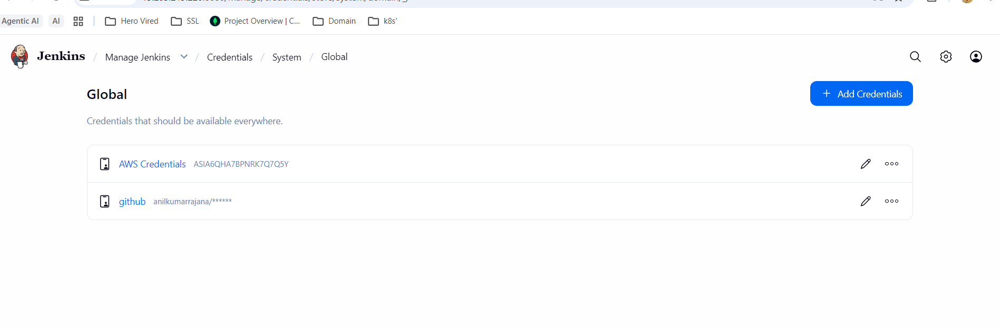
  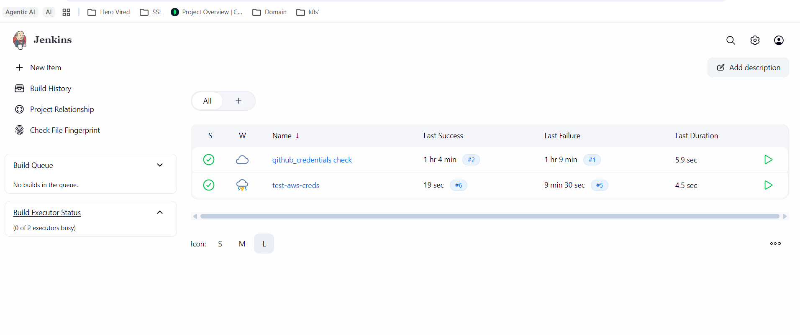

- Configure the GitHub webhook

  - In your fork: Settings → Webhooks → Add webhook http://<jenkins-ip>:8080/github-webhook/, content type application/json,      trigger on push events.

  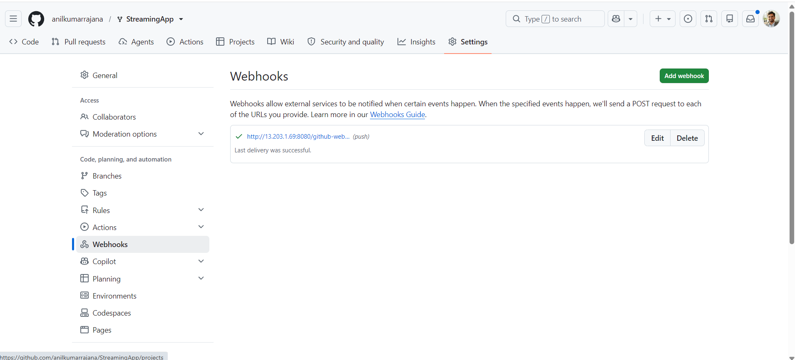

- Created a IAM user for Jenkins server
  - In AWS Consol: Add a new user in IAM and create access key and add those details in jenkins credentials configuration

  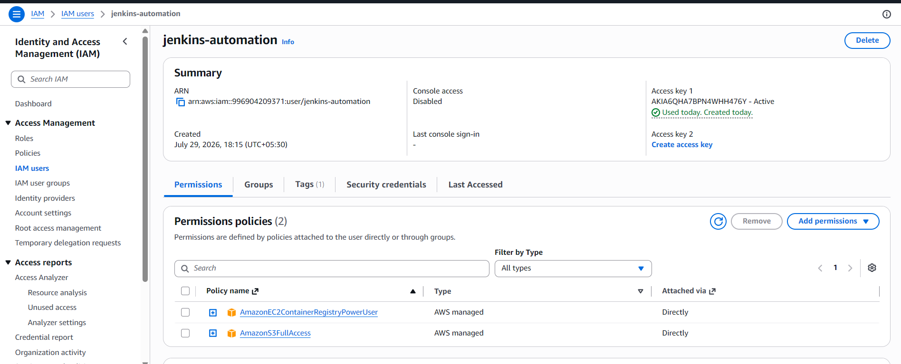

- Install Docker and authorize Jenkins to use it

  ```bash
    sudo docker run hello-world
    sudo usermod -aG docker "$USER"
    sudo usermod -aG docker jenkins
    sudo systemctl restart jenkins
    sudo -u jenkins docker run hello-world
  ```

  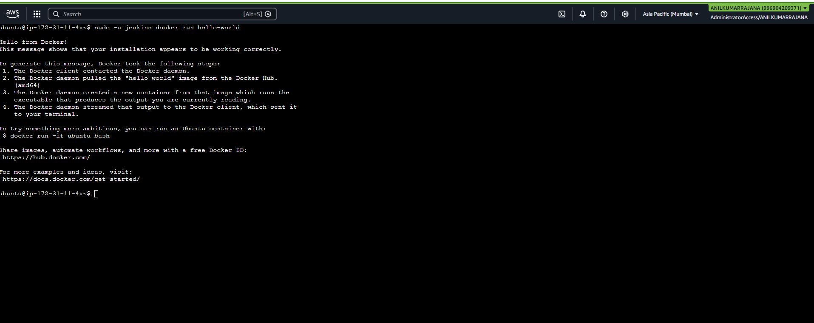

- Verify Jenkins build prerequisites

  ```bash
    git --version
    docker --version
    sudo -u jenkins docker version
    aws sts get-caller-identity --region ap-south-1
  ```

  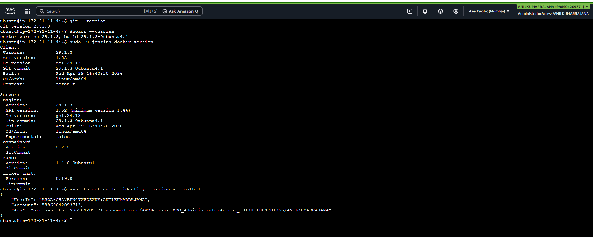

- Add swap to the constrained Jenkins EC2 instance

  ```bash
    sudo fallocate -l 2G /swapfile
    sudo chmod 600 /swapfile
    sudo mkswap /swapfile
    sudo swapon /swapfile
    echo '/swapfile swap swap defaults 0 0' | sudo tee -a /etc/fstab
    free -h
  ```

  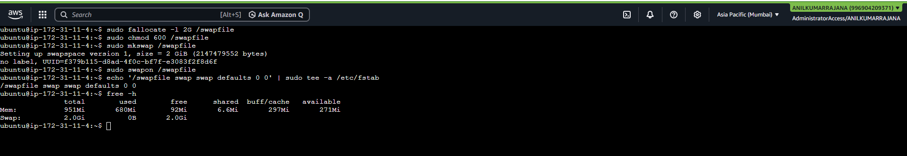

- Check Jenkins disk capacity and clean Docker cache when necessary

  ```bash
    df -h /
    sudo docker system df
    sudo docker system prune -af
    df -h /
  ```

  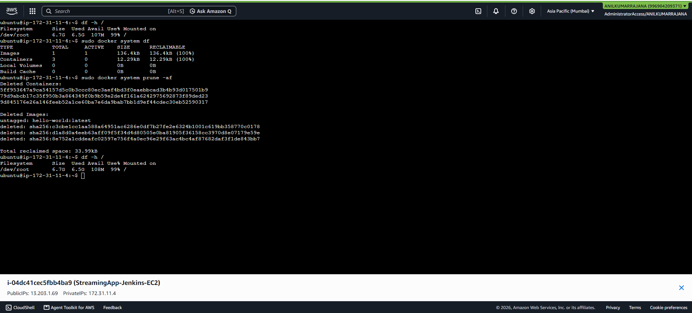

- Create a SNS alert Topic 

  ```bash
    aws sns create-topic --name streamingapp-alerts \
  ```

- Add and confirm an SNS email subscription

```bash
  aws sns subscribe \
    --topic-arn "arn:aws:sns:ap-south-1:996904209371:streamingapp-alerts" \
    --protocol email \
    --notification-endpoint "anilkumarrajana02@gmail.com" \
  
  aws sns list-subscriptions-by-topic --topic-arn "arn:aws:sns:ap-south-1:996904209371:streamingapp-alerts" \
  --query 'Subscriptions[].[Protocol,SubscriptionArn]' --output table
```

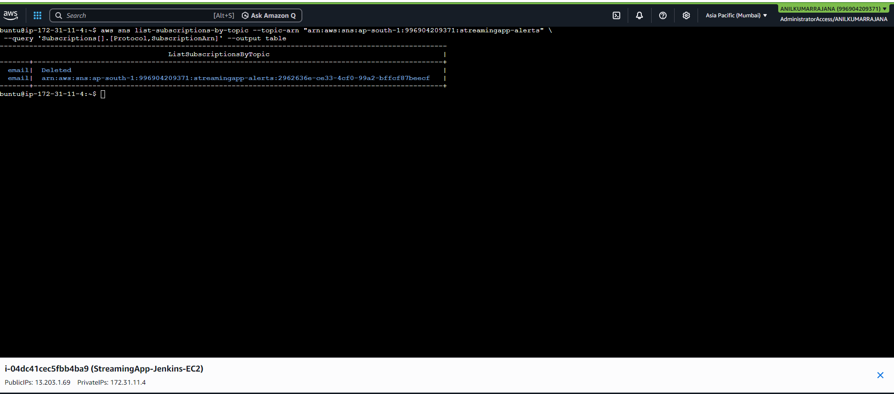